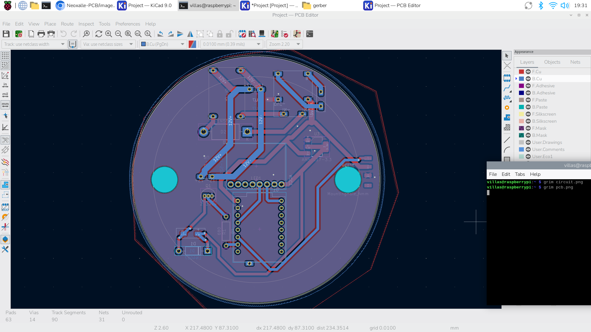
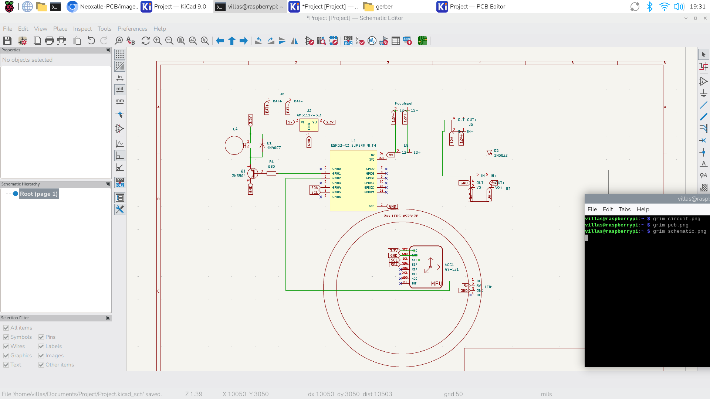
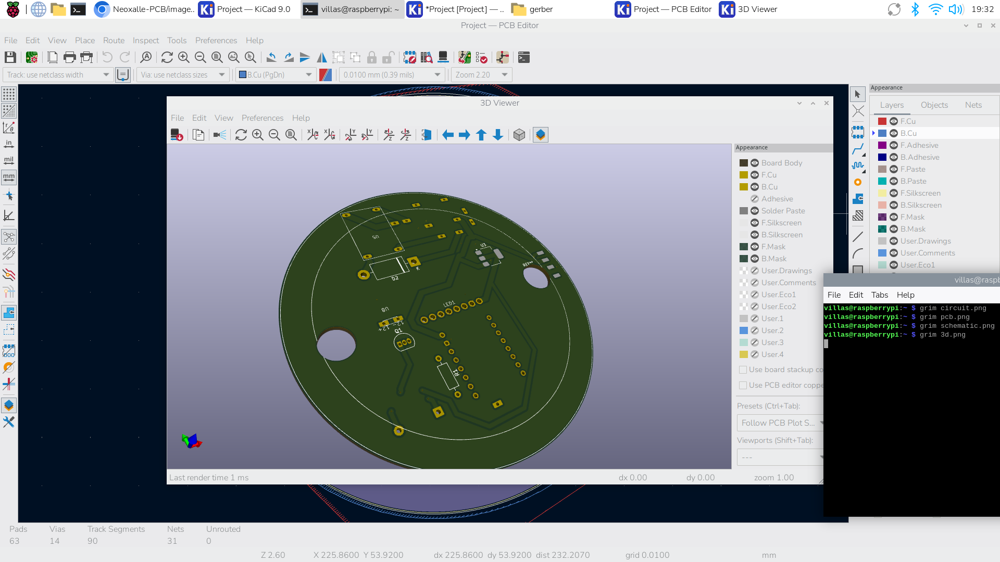

# NeoXalle-PCB

A full PCB work for a sport sensorial reaction device called NeoXalle.

**Overview**

This repository contains the design files and the images of each part.

**Screenshots**

**Bill of Materials (BOM)**
- ESP32-C3 Super mini - x1
- MPU6050 Acelerometer - x1
- 4 pin 360 magnetic Pogo pins Female and Male connectors - x1
- 1200mAh battery - x1
- Coin Vibrator motor - x1
- 24x LED (Bit) WS2812B Led ring Adafruit - x1
- 12v - 5v Voltage Regulator module - x1
- 2N3904 Transistor THT x1
- 1N4007 Shockty Diode THT x1
- 680ohm resistor THT x1
- AMS1117 3.3v Voltage Regulator SMD x1
- 5V USB-C Battery charger Module x1

**Repository layout**
- `cad/` — CAD files and case models
- `pcb/` — KiCad schematic and PCB files- `firmware/` — KMK firmware and `keymap.py`
- `images/` — project screenshots used by this README

