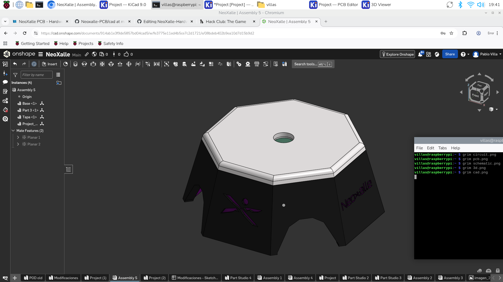

# NeoXalle-PCB

A full PCB work for a sport sensorial reaction device called NeoXalle.

### [Watch this video on YouTube](https://youtu.be/leAVq9ZJ1fE)

**Overview**

This repository contains the design files and the images of each part.

**Screenshots**

Item,Description,Quantity,Unit Price ($),Total Price ($),URL,Running Total
ESP32-C3 Super Mini,Microcontroller,1,3.48,3.48,https://es.aliexpress.com/item/1005007941259180.html,3.48
MPU6050 , Acelerometer,1,2.47,2.47,https://es.aliexpress.com/item/1005008796700745.html,5.95
Pogo Pins,4 pin 360 Degree Magnetic Pogo Pins,1,4.3,4.3,https://es.aliexpress.com/item/1005007457425590.html,10.25
1200mAh battery,,1,24.59,24.59,https://es.aliexpress.com/item/1005011601135401.html,34.84
Coin Vibrator Motor,,1,1.22,1.22,https://es.aliexpress.com/item/1005006713206227.html,36.06
24x LED Ring WS2812b,,1,2.24,2.24,https://es.aliexpress.com/item/1005009290613680.html,38.3
12v-5v Buck Converter,,1,3.04,3.04,https://es.aliexpress.com/item/1005008257960729.html,41.34
2n39004 Transistor,,1,4.1,4.1,https://es.aliexpress.com/item/1005004029392929.html,45.44
1N4007 Diode,Schockty Diode,1,1.75,1.75,https://es.aliexpress.com/item/1005007807556976.html,47.19
680ohm resistor,Resistor,1,1.33,1.33,https://es.aliexpress.com/item/32847423196.html,48.52
AMS1117,,1,1.34,1.34,https://es.aliexpress.com/item/4001091314348.html,49.86
USB-C Battery Charger Module,,1,1.1,1.1,https://es.aliexpress.com/item/1005006161180492.html,50.96

**Repository layout**
- `cad/` — CAD files and case models
- `pcb/` — KiCad schematic and PCB files- `firmware/` — KMK firmware and `keymap.py`
- `images/` — project screenshots used by this README

